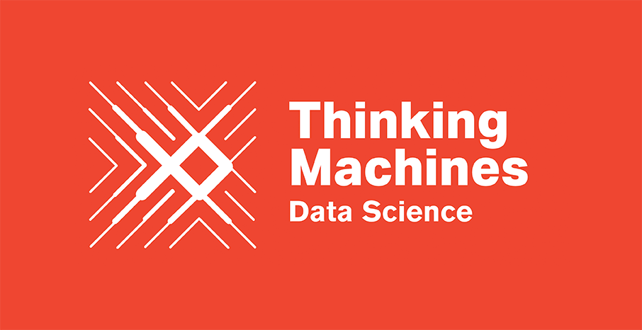
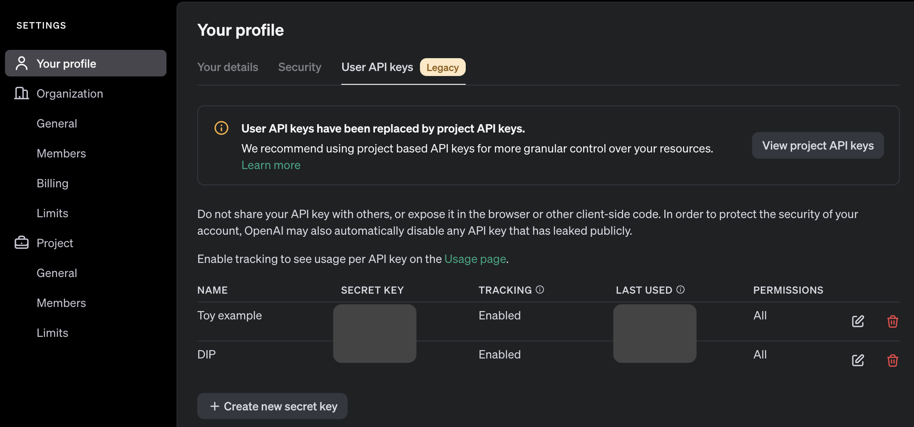
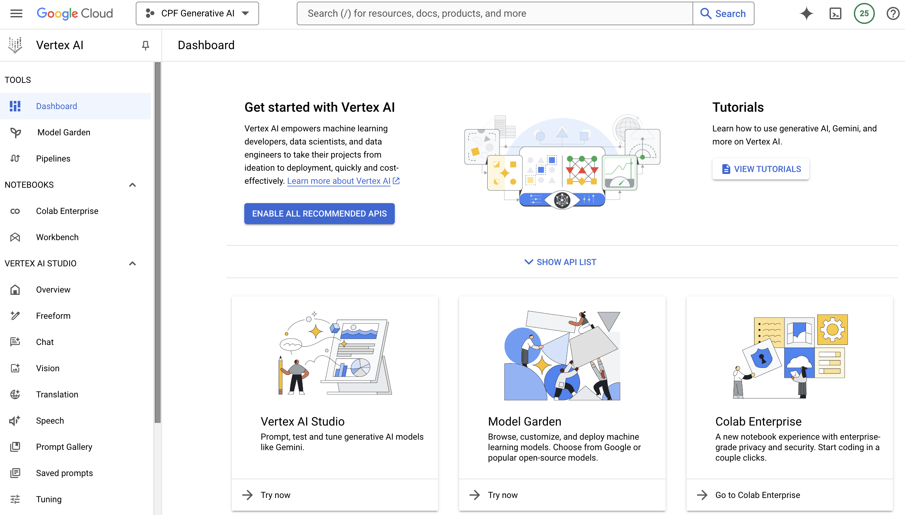

# CPF Generative AI Workshop


Repository นี้ประกอบด้วยโค้ดสำหรับการประชุมเชิงปฏิบัติการ Generative AI สำหรับ CPF workshop

## ภายใน Repository

- `tutorial_notebooks` ประกอบด้วย Jupyter notebooks สำหรับบทเรียน
- `data` ประกอบด้วยข้อมูลที่เกี่ยวข้องกับบทเรียนนี้

## การติดตั้ง library ต่างๆ
สร้าง virtual environment
```
$ python -m venv ./.venv
```
```
$ source .venv/bin/activate
```
```
$ pip install -r requirements.txt
```

## ข้อมูลเพิ่มเติม

### วิธีสร้าง API Key จาก OpenAI

- เปิดเว็บเบราว์เซอร์และไปที่ https://platform.openai.com/
- คลิกที่ปุ่ม "Sign up" ที่มุมขวาบนของหน้าเว็บ, ถ้ามีบัญชีอยู่แล้ว ให้คลิก "Log in" แทน
- หลังจากเข้าสู่ระบบแล้ว ให้คลิกที่ชื่อผู้ใช้ของคุณที่มุมขวาบน และเลือก "Your Profile" ตามด้วย "User API keys"
- ในหน้า API keys ให้คลิกปุ่ม "Create new secret key" แนะนำตั้งชื่อให้กับ API key ของคุณ การตั้งชื่อไม่บังคับ แต่แนะนำให้ตั้งเพื่อจำได้ง่าย จากนั้นระบบจะแสดง API key ของคุณ ให้คัดลอกและเก็บไว้ในที่ปลอดภัย (สำคัญ: คุณจะเห็น API key นี้ครั้งเดียวเท่านั้น ถ้าคุณทำหาย จะต้องสร้างใหม่)
- เมื่อคัดลอก API key เรียบร้อยแล้ว ให้คลิก "Done" จากนั้นจะสามารถใช้ API key นี้ในการเข้าถึงบริการต่างๆ ของ OpenAI ผ่าน API ได้แล้ว



หลังจากได้ API key แล้วเราสามารถเรียกใช้ ChatGPT ผ่าน Python ได้ด้วยคำสั่ง

```py
from openai import OpenAI
from IPython.display import display

OPENAI_API_KEY = "<api-key>" # ใส่ API key ที่นี่
client = OpenAI(api_key=OPENAI_API_KEY)

def get_completion(prompt: str):
    response = client.chat.completions.create(
        model="gpt-3.5-turbo",
        messages=[{"role": "user", "content": prompt}]
    )
    return response.choices[0].message.content.strip()

get_completion("Why is sky blue?")
```

### วิธีสร้าง JSON Credential จาก Google Cloud Platform

- ไปที่ https://cloud.google.com/vertex-ai และเข้าไปยัง "Try it in console" จากนั้น Enable Vertex AI service เพื่อให้สามารถใช้งานโมเดล Gemini ได้ ถ้าสนใจเล่นก่อนให้กดไปในแถบ "Freeform" เพื่อทดลองเล่นก่อนได้



- จากนั้นกลับไปที่ https://console.cloud.google.com/  สร้าง Project ใหม่ถ้ายังไม่เคยสร้าง
- เข้าไปยัง APIs & Services และกดปุ่ม "+ Create Credentials > Service Account" เพื่อสร้าง Credential ใหม่ ในข้อ "Grant this service account access" ให้เลือก Vertex AI Administrator
- เมื่อสร้างเสร็จเรียบร้อย กลับมาที่หน้า Service Account และไปที่หัวข้อ Keys จากนั้นกด Add Key > Create new key เพื่อสร้าง JSON ไฟล์
- จากนั้นไฟล์จะถูกดาวน์โหลดเข้ามาในเครื่อง และเราสามารถใช้ Python ในการเรียกใช้ Gemini ได้ดังนี้

```py
from google.oauth2 import service_account
from google.cloud import aiplatform
from vertexai.generative_models import GenerativeModel

project_name = "<project-name>"
credentials = service_account.Credentials.from_service_account_file("<path-to-json>")
aiplatform.init(project=project_name, credentials=credentials)

model = GenerativeModel("gemini-1.5-flash-001")
print(model.generate_content("Why is sky blue?"))
```
### Reference Agent

*AutoGen documentation*:
https://microsoft.github.io/autogen/docs/Getting-Started

*Autogen Example codes*:
https://microsoft.github.io/autogen/docs/Examples/#automated-multi-agent-chat